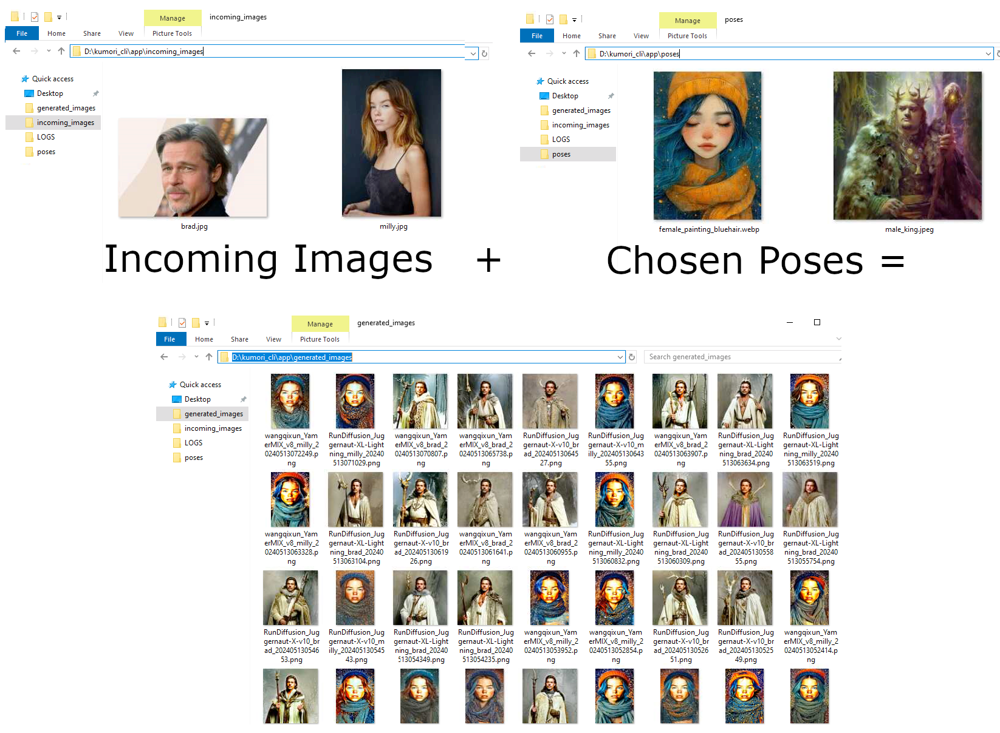
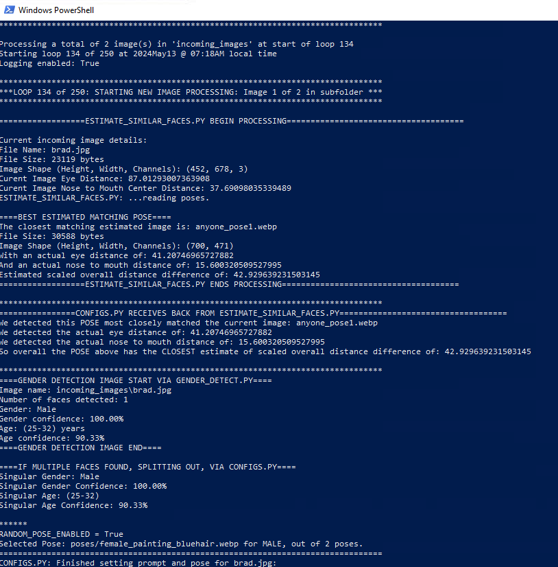
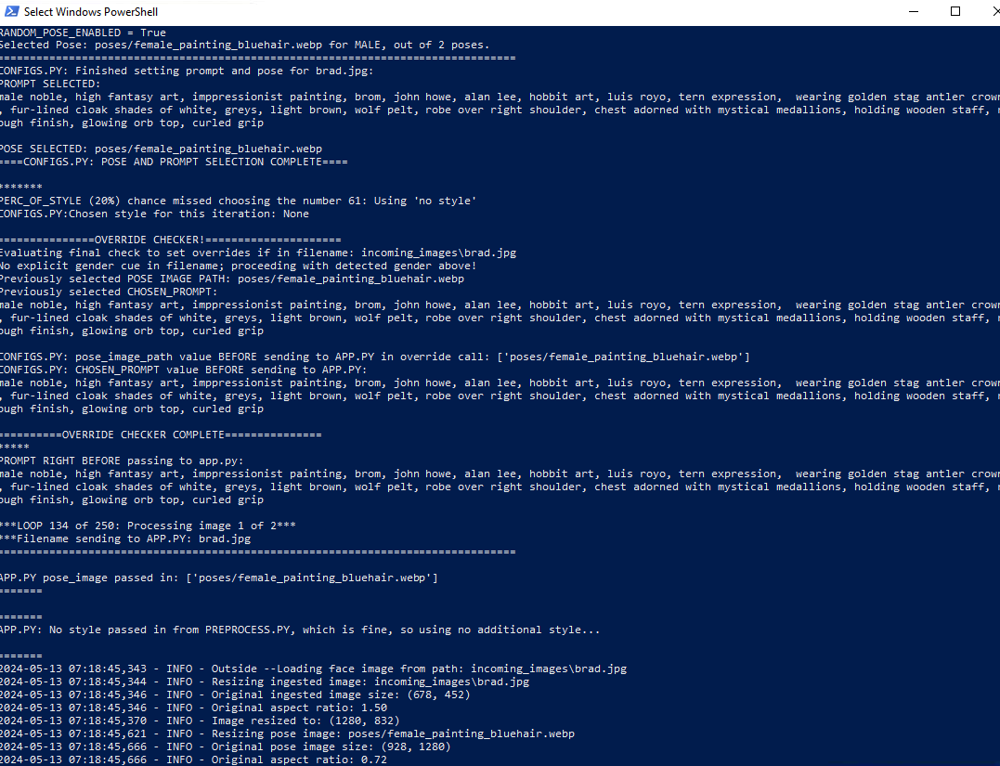
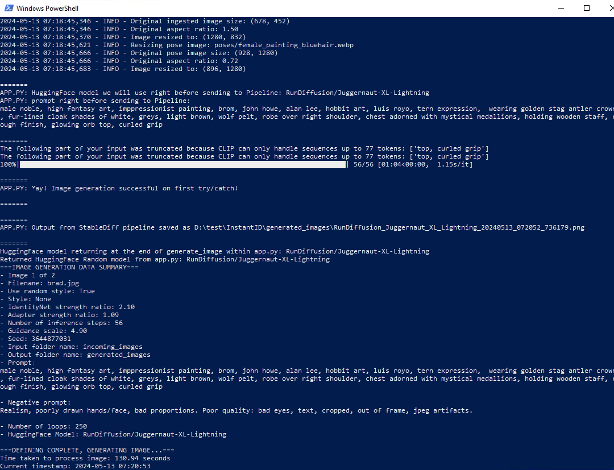
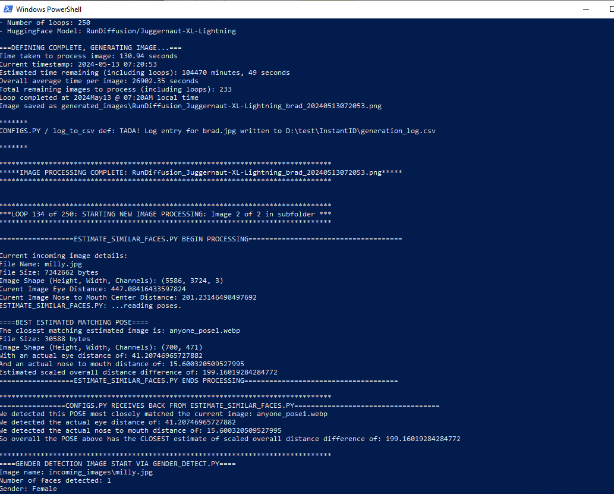

# Kumori CLI Python automation using InstantID and HuggingFace/Diffusers


### Key Features
- Fully Python CLI-based interaction
- Enhanced image processing/enhancement and customization
- Gender-aware image generation/prompting
- Estimating similar pose styles based on facial landmark data
- Looping mechanism randomizing IdentityNet, AdapterStrength, Guidance and Inference metrics with some best-sample settings.
- Generation CSV log so you can determine what random values were chosen to lock in your preferences of data points above to better fine-tune as "beauty is in the eye of beholder"...


## Introduction
InstantID  [InstantID GitHub](https://github.com/InstantID/InstantID) has an excellent, tuning-free approach to identity-preserving generation, allowing for the swift creation of stylized portraits with a singular input image. The original InstantID implementation, leverages state-of-the-art AI to achieve remarkable fidelity in generated images, supporting a wide range of artistic renditions while preserving the unique identities captured in source images.

InstantID is accessible through user-friendly interfaces like Gradio, facilitating easy experimentation for users without deep technical expertise in command-line tools or programming. While this approach demystifies AI's complexities, it often caters to one-off generation tasks rather than batch processing or integrated workflows that many developers and researchers may require, I wanted to be able to "set it and forget it" to generated images.

Since its realized I have been testing a way to automate InstantID in conjunction with various working HuggingFace models to offer a more versatile and automation-friendly solution. This approach is designed for those seeking deeper customization, speed in batch image processing, and a more scriptable interaction with InstantID's capabilities, bypassing the GUI constraints for increased flexibility and efficiency.

## Why a CLI-based Approach?
The motivation behind developing a CLI-based interface for InstantID interaction stems mostly from the fact that I have an RTX3060, and waiting for an image to just try another bunch of settings was too time consuming, and would rather create several, and decide for myself what felt best, based on some of the ideal settings at differing strengths --it's worked out pretty good so far, so thought I'd share.

This project, therefore, extends the original brilliance of InstantID into a realm where developers and researchers can harness its capabilities in a more flexible, efficient, and programmable manner, opening new avenues for creative and analytical tasks without relying on graphical interfaces.

## Getting Started

# Windows Users: Automated Setup Script
For Windows users, there's an automated batch script auto_install_kumori_cli.bat available in the root of the project directory. This script handles the complete setup process, including environment setup, repository cloning, dependency installation, and more.

To Use the Automated Script:

Double-click the auto_install_kumori_cli.bat file or run it using the command line:

```
./auto_install_kumori_cli.bat
```

Follow the on-screen instructions. The script will:

Check for Python installation.
Create and activate a Python virtual environment.
Clone the kumori_cli_engine repository.
Install required Python libraries.
Install the appropriate version of PyTorch with CUDA support.
Download and extract additional files for facial detection and analysis.
Note for Non-Windows Users: While this script is designed for Windows, you can refer to it for the required steps and adapt the commands for macOS or Linux environments.

### Manual Installation Instructions

For those who prefer or need to install everything manually, detailed step-by-step instructions for the Kumori CLI engine, certain prerequisites must be in place:

1. **Python 3.8 or Newer**: Ensure you have Python installed on your system. This project requires Python 3.8 or newer.

2. **Git**: Git is essential for cloning the project repository to your local machine. If you do not have Git installed, please follow these instructions to install it:

#### Installing Git

- **Windows**:
  a. Download the latest Git for Windows installer from [Git's official website](https://git-scm.com/download/win).
  b. Run the installer and follow the installation prompts. Accepting the default options is recommended for most users.

- **macOS**:
  a. Git might already be installed on your machine. You can check by running `git --version` in the Terminal.
  b. If you don't have Git installed, the easiest way to install it is via the standalone installer:
      - Download the latest macOS Git installer from [Git's official website](https://git-scm.com/download/mac).
      - Follow the on-screen instructions to complete the installation.
  c. Alternatively, you can install Git using Homebrew (if installed):
      - Run `brew install git` in the Terminal.

- **Linux (Ubuntu/Debian)**:
  a. Open the Terminal.
  b. Update your package lists with `sudo apt update`.
  c. Install Git by running `sudo apt install git`.
  d. Verify the installation with `git --version`.

3. **Virtual Environment Setup**: Ensure you have Python 3.8 or later installed on your system. Using a virtual environment is highly recommended to prevent conflicts with other Python projects or system-wide packages.

## Recommendation: Using a Python Virtual Environment

A Python virtual environment (venv) offers a self-contained directory within a project, encapsulating its own installation directories for software and packages. This isolation prevents conflicts between project dependencies and system-wide Python installations. It's highly recommended for projects like the Kumori CLI tool, where specific versions of libraries and dependencies are critical for functionality and stability. Below is a guide to setting up and managing a Python virtual environment for this project.

### Setting Up a Virtual Environment

a. **Installation**
   - Ensure Python 3.8 or newer is installed on your system. The Python installation includes `venv` for creating virtual environments.
   
b. **Creating a Virtual Environment**
   - Open a terminal (Command Prompt or PowerShell on Windows, Terminal on macOS and Linux).
   - Navigate to the project directory:
     ```bash
     cd path/to/your/project
     ```
   - Create the virtual environment:
     - **Windows**:
       ```cmd
       python -m venv kumori_venv
       ```
     - **macOS/Linux**:
       ```bash
       python3 -m venv kumori_venv
       ```

   `kumori_venv` is the name of your virtual environment, and you can rename it to anything you like.

c. **Activating the Virtual Environment**
   Before installing packages and running your project, you need to activate the virtual environment. Once activated, any Python or pip commands will use the versions in the virtual environment, not the global Python installation.
   - **Windows**:
     ```cmd
     .\kumori_venv\Scripts\activate
     ```
   - **macOS/Linux**:
     ```bash
     source kumori_venv/bin/activate
     ```

   You'll know the virtual environment is activated because the command prompt will show the name of your virtual environment, e.g., `(kumori_venv) user@hostname:~/path/to/project$`.

4. **Clone the Kumori CLI Project**: Now that you have a virutal env, Python, and Git installed, clone the project repository to your machine via [Kumori CLI Engine GitHub Page](https://github.com/tillo13/kumori_cli_engine.git) to have access to the functionality by running the following command in your terminal or command prompt:

    ```
    cd path\to\location\you\want
    git clone https://github.com/tillo13/kumori_cli_engine.git
    cd kumori_cli_engine
    ```

5. **Install Required Libraries**: 
Once downloaded install the required libraries: 
    ```
    pip install -r kumori_cli_engine/requirements.txt -v
    ```

    This will ensure all necessary Python libraries, such as `diffusers`, `opencv-python`, `insightface`, `dlib`, and others, are installed in your environment.  It might take a few minutes, the -v tells it to show verbosely, but can take 5+ mins, be patient.

6. **Install PyTorch**: The requirements.txt file installs a standard pytorch version, but if you have an NVIDIA card, you want your own version from [PyTorch.org](https://pytorch.org --it will show your install command on the page itself. If you installed or have it installed, you might need to uninstall a previous version first...

```
pip uninstall torch torchvision torchaudio
```

...as the requirements.txt file might install a version not compatible with your card.  Specifically UNINSTALL is needed, before proceeding with your CUDA verison. 

While CUDA is not strictly necessary for running the tool, using a GPU can significantly accelerate the image generation process. Without a CUDA-enabled GPU, the generation process can be markedly slower—taking roughly 5-10 minutes per image based on standard inference steps and configurations in `configs.py`. For my setup with an NVIDIA RTX 3060, images are processed overnight, yielding a batch of outputs by the morning. To install PyTorch with CUDA support for an NVIDIA GPU, use the following command:

Commands will differ slightly to incorporate CUDA support:

For GPU-enabled systems (assuming CUDA is available), visit [PyTorch's Get Started page](https://pytorch.org/get-started/locally/) to select a command fitting your setup. An example for CUDA 11.8:

    pip install torch torchvision torchaudio --extra-index-url https://download.pytorch.org/whl/cu118

For systems without GPU support, a standard PyTorch installation suffices:

    pip install torch torchvision torchaudio

For my RTX3060, this is the command I get from pytorch.org on the homepage: 

    pip3 install torch torchvision torchaudio --index-url https://download.pytorch.org/whl/cu118

and it will show something like:

    (kumori) PS D:\test> pip3 install torch torchvision torchaudio --index-url https://download.pytorch.org/whl/cu118
    Looking in indexes: https://download.pytorch.org/whl/cu118
    Collecting torch...


If you do not have a CUDA-enabled GPU, you can visit [PyTorch's official website](https://pytorch.org/get-started/locally/) to find the appropriate installation command for CPU-only support. Remember, the CUDA version (`cu118` in the command above) should match your system's CUDA installation if using GPU acceleration.


7. **Additional files needed via Google Drive**: For facial detection and landmarks analysis and AntelopeV2, ensure you have the following models in your `facial_landmarks_model` and `model` directories in the root of the project (download from the PLACEHOLDER_ links in the repo as too big for Github) --download them both and unzip them into the kumomri_cli_engine directory: https://drive.google.com/file/d/1jdfyvxHMvAN7OJMW3zGn0IZZ107OxmqN/view?usp=sharing

    - `deploy.prototxt.txt`
    - `pose_deploy_linevec.prototxt`
    - `res10_300x300_ssd_iter_140000.caffemodel`
    - `shape_predictor_68_face_landmarks.dat`

    These models are crucial for the `gender_detect.py` and `estimate_similar_faces.py` scripts to function correctly, allowing for accurate gender detection and pose estimation.

  At the end you should have 2 folders called `kumori_cli_engine/models` and `kumori_cli_engine/facial_landmakr_model` after downloading the files.

8. ***Run it!***
Make sure you're in the kumori_cli_engine directory and run: 

    python ./kumori_cli.py
    
If all goes as planned, you should start seeing values populating in the generated_images folder!

## Usage
### KUMORI_CLI.PY

This `kumori_cli.py` stands as the operational core of the project.  This script is the entry point for executing the generation process, embodying the fusion of advanced AI models with custom enhancements for an enriched user experience.  All configurations and updates you'll change up in CONFIGS.SYS

### CONFIGS.PY

The `configs.py` script, serves as a catch-all to make setting changes --it's got all your fun settings, to the core functionality of the Kumori CLI Engine image generation tool. This extension introduces advanced capabilities primarily focused on optimizing and customizing the input image set before they are processed by `kumori_cli.py`. Leveraging the insights from facial analysis and pose estimation, it further streamlines the generation process to produce stylized and identity-preserved images en masse.

#### Key Enhancement Functions:

- **Automated Image Looping:** One of the main features of `configs.py` is its automated looping mechanism. This functionality allows users to process a batch of images stored in a specified directory without requiring manual intervention for each image. This batch processing significantly accelerates the generation workflow, particularly beneficial for projects with large datasets.

- **Dynamic Style Application:** `configs.py` enables dynamic application of stylistic elements based on a comprehensive style template. Users can specify or allow the script to randomly apply artistic styles to each image, ensuring a range of visually diverse outputs. This flexibility opens the door for experimentation with various artistic renditions, including those not originally contemplated by the InstantID model.

- **Pose Estimation Integration:** Through advanced facial landmark detection, this script estimates the pose of subjects within input images and aligns them with predefined or detected styles for more contextually appropriate results. This feature ensures that the generated images maintain a natural and coherent aesthetic, respecting the original posture and orientation of the subjects.

- **Gender-aware Prompt Adjustment:** Building on gender detection capabilities, `configs.py` intelligently adjusts prompts and style applications to align with the detected gender of subjects in the images. This sensitivity adds a layer of personalization, ensuring that the stylistic outputs are not just visually appealing but also contextually relevant.

- **Custom Configurations for Enhanced Outputs:** Users have the ability to tweak various parameters and configurations, adjusting the balance between identity preservation and artistic expression. These configurations are designed to offer a broad spectrum of control over the output characteristics, from fidelity to the source image to the incorporation of fantastical elements.

#### Working Principle:

At its essence, `configs.py` acts as the intermediary between raw input data and the generative AI models. By preprocessing images — adjusting dimensions, applying filters, or selecting poses — and specifying generation parameters, it enriches the input data to better suit the model's needs and user expectations. This preprocessing layer ensures a higher quality and more customized output, distinguishing the CLI tool's capabilities from standard InstantID implementations.

### generation_log.csv

The `generation_log.csv` is an innovative addition to this CLI-based image generation framework that markedly enhances the usability and analytical capabilities of the tool. Diverging from the standard InstantID implementation, which primarily focuses on the generation outcomes without comprehensive tracking of the generative parameters and results, this logging mechanism provides a detailed record of each generation attempt, encompassing a wide array of parameters and outcomes.

#### Key Features of generation_log.csv:

- **Comprehensive Tracking**: It logs every crucial parameter involved in the image generation process, including `image_name`, `new_file_name`, model parameters (`identitynet_strength_ratio`, `adapter_strength_ratio`, `num_inference_steps`, `guidance_scale`), `seed`, and the successful completion status (`success`).

- **Error Logging**: In instances where the generation process encounters issues, `error_message` captures the specifics of what went wrong, aiding in troubleshooting and refining the generative approach.

- **Style Application Insights**: Detailed logging of `style_name`, along with `prompt` and `negative_prompt` used for generation, offers insights into how different styles and textual cues influence the generation outcomes, providing a window into effective prompt engineering.

- **Performance Metrics**: Each entry records the `time_taken` for generation and the `current_timestamp`, facilitating analysis of the system's performance over time and under different configurations.

- **Demographic Parameters**: Unique to this tool, parameters like `gender`, `gender_confidence`, `age`, and `age_confidence` are logged, demonstrating the tool’s capability to analyze and adapt to the demographic attributes of subjects in the images.

- **Pose Analysis**: The log provides references to the `chosen_pose` and `most_alike_pose` along with distances (`most_alike_eye_distance`, `most_alike_nose_mouth_distance`, `most_alike_distance_difference`), indicating the effectiveness and accuracy of pose estimation and matching in the generation process.

#### Improvement Over InstantID GUI version:

This rich logging capability provides an unparalleled advantage for users and researchers aiming to deeply understand the generative process and its dependencies on various parameters and conditions. It allows for:

- **Iterative Improvement**: By analyzing logs, users can iteratively adjust parameters to achieve desired outcomes, empirically identifying optimal configurations.
  
- **Troubleshooting and Optimization**: Identification of recurrent issues or bottlenecks becomes easier, guiding users in troubleshooting or further optimizing the generation pipeline.
  
- **Data-Driven Insights**: The accumulated data can be analyzed for patterns or insights, potentially revealing new knowledge about generative AI behaviors, style applicability, or demographic representation effectiveness.

- **Enhanced Experimentation**: With detailed records, users can more systematically experiment with different configurations, styles, or demographics, making informed decisions to refine their creative or research endeavors.


Additionally, a utility script `summarize_and_merge_generation_log.py` is provided to help you analyze and summarize your generation results:

#### Purpose of `summarize_and_merge_generation_log.py`

The `summarize_and_merge_generation_log.py` script is a powerful tool designed to help users determine their favorite outcomes from the generated images. This script analyzes the logs generated during the image generation process, providing detailed statistics and insights into the effectiveness of different models and settings.

#### What The Script Does:
1. **Merges Multiple Log Files**: Combines multiple `generation_log.csv` files into a single merged log if multiple runs were executed.
2. **Tracks and Calculates Metrics**: Keeps track of various metrics such as `identitynet_strength_ratio`, `adapter_strength_ratio`, `num_inference_steps`, `guidance_scale`, and more for each model used.
3. **Cleans Up Log Files**: Removes rows with missing or insufficient data to ensure the accuracy of analysis.
4. **Provides Detailed Stats**: Outputs detailed statistics for individual models as well as combined averages across all models. This includes usage counts, average values of key metrics, and more.
5. **Efficiency Indexes**: Calculates and displays special indexes like the Preference Efficiency Index (PEI) and Model Efficiency Index (MEI) to rank models based on performance and effectiveness.

#### How to Use the Script

1. **Navigate to `generation_images` Folder**:
   Ensure you are in the `generation_images` folder where your generated images and log files are stored.
   ```sh
   cd kumori_cli_engine/generation_images
Run the Script: Execute the summarize_and_merge_generation_log.py script using Python.
```
python summarize_and_merge_generation_log.py
```
# Review Outputs and Stats:

Detailed stats and efficiency indexes will be printed to the console.
Individual and combined stats give insights into which models and settings were most effective.
Use these insights to fine-tune your configurations and prompts for future runs.
By using the summarize_and_merge_generation_log.py script, users can gain valuable insights into their image generation processes, allowing for more informed decisions and better optimization of future generation tasks.

In essence, the generation_log.csv and summarize_and_merge_generation_log.py script not only serve as vital record-keeping tools but also as catalysts for exploration, experimentation, and optimization within the advanced CLI-based image generation tool, setting it apart from and ahead of the traditional InstantID usage scenario.

In essence, the `generation_log.csv` not only serves as a vital record-keeping tool but also as a catalyst for exploration, experimentation, and optimization within the advanced CLI-based image generation tool, setting it apart from and ahead of the traditional InstantID usage scenario.  Used in concert with `summarize_and_merge_generation_log.py` will help you fine-tune your likes!

### gender_detect.py

`gender_detect.py` significantly enhances the CLI-based image generation process by introducing robust gender and age detection capabilities. This module empowers the generation tool with the ability to automatically adjust image generation parameters based on the detected gender and age of the subjects within the input images. This facilitates a deeper level of personalization and relevance in the generated artwork, harmoniously aligning with the overall vision of creating highly customized and identity-preserving images for both male and female prompts in the same automation.

#### gender_detect.py integration with Configs.py

- **Seamless Workflow Integration:** The gender and age data extracted by `gender_detect.py` are pivotal in `configs.py` for deciding on appropriate prompts and styles. Based on the demographic attributes of the subjects in the input images, `configs.py` can dynamically adjust its configurations to match, enhancing the relevancy and precision of the generated images.

- **Custom Prompt Adjustment:** Armed with the knowledge of a subject's gender and approximate age range, the script tailors the generative prompts to better fit the subject's identity, steering the AI towards producing images that not only captivate in style but also remain true to the subject's essence.

- **Style Selection Enhancement:** Understanding the gender and age facilitates refined control over style application. For instance, specific styles might be more fitting for a female subject in a given age range, or vice versa, allowing `configs.py` to make informed decisions that greatly influence the stylistic outcome.

#### Why Gender Detection Matters

- **Increases Relevancy:** By leveraging gender and age information, the system ensures that the generated images are not just visually stunning but also contextually appropriate, increasing the relevancy and personalization of the output.

- **Enables Gender-aware Prompting:** The detected gender and age information enable `configs.py` to apply gender-aware and age-appropriate prompts. This adds a layer of sophistication to the generation process, ensuring that the final images are reflective of the subjects’ characteristics.

- **Fosters Experimentation:** With `gender_detect.py`, users have the opportunity to experiment how different genders and age groups are represented in various artistic styles. This can lead to fascinating insights into the interaction between identity attributes and artistic expression.

#### Empowering Personalized Image Generation

In summary, `gender_detect.py` stands as a cornerstone module that significantly enriches the image generation process by ensuring that gender and age are taken into account. This careful consideration ensures that each generated image is not only a work of art but a personalized and identity-preserving creation that respects and reflects the subject’s characteristics. The seamless integration with `configs.py` empowers users to delve into unparalleled levels of customization, setting the foundation for generating images that are truly one-of-a-kind.

### estimate_similar_faces.py

The `estimate_similar_faces.py` script enriches the CLI-based image generation project by incorporating an advanced pose estimation functionality. This module is specifically designed to analyze input images for facial landmarks, estimating poses that closely match those from a predefined repository or dynamically identified styles. This tailored approach significantly refines the preparatory phase of the image generation process, executed by `configs.py`, ensuring that generated images bear a striking resemblance to the source images not only in style but also in posture and expressiveness.

#### estimate_similar_faces.py integration with configs.py

- **Enhanced Pose Alignment:** By accurately estimating the facial pose of subjects in input images, `estimate_similar_faces.py` allows `configs.py` to select or adjust prompts and styles that harmonize with the subject's pose. This critical integration ensures that the generative models are primed with contextually cohesive inputs, enhancing the naturalness and authenticity of the generated images.

- **Customization of Image Generation:** Empowered with precise pose information, `configs.py` can delve into an expanded realm of customization. Depending on the pose features determined by `estimate_similar_faces.py`, various stylistic nuances and environmental contexts can be dynamically introduced or modified within the generation prompts, offering an enriched canvas for creative expressions.

- **Optimization of Style and Pose Dynamics:** The script plays a pivotal role in optimizing the interplay between style and pose dynamics. With the detailed pose data sourced from`estimate_similar_faces.py`, `configs.py` is adept at fine-tuning the generation process to ensure that the stylistic attributes and the physical posture of the subjects are in perfect symbiosis. This synergy is crucial for achieving high-fidelity outcomes that resonate with the original identity and setting of the source images.

#### Why Pose Estimation Matters

- **Elevates Image Realism:** Accurate pose estimation directly contributes to the realism of the generated images. By ensuring that the subjects' poses are correctly identified and matched, the final images not only capture the essence of the subject's identity but also reflect their demeanor and spatial context, thus elevating the overall realism.

- **Facilitates Context-aware Generation:** The ability to estimate and align poses ensures that the generated images are not just static portraits but vibrant representations that capture subjects in contextually rich settings. This depth of context-awareness adds layers to the storytelling aspect of the images, enriching the narrative woven through visual imagery.

- **Promotes Creative Experimentation:** With detailed insights into pose dynamics, users are encouraged to experiment with how different poses interact with various styles and contexts. This experimentation can lead to innovative artistic explorations, uncovering new aesthetical territories within the realm of AI-assisted image generation.

In essence, `estimate_similar_faces.py` serves as a critical component that seamlessly bridges the gap between raw input imagery and the nuanced requirements of artistic image generation. Through its integration with `configs.py`, it lays the groundwork for producing images that are not only visually captivating but also deeply personalized, reflecting a true convergence of art, technology, and individual identity.


### Handling and saving generated images
Changed the InstantID version to auto-upsize/scale images and save during the looping in standard location.

Flexible Model and Style Selection: Users can select from a variety of pre-trained models or define custom prompts that guide the AI in producing desired visual styles and themes with some added other themes that have worked from the configs.py alignment.

Adjustable Parameters: Enables on-the-fly modification of generation parameters including but not limited to the strength of identity preservation, artistic style influence, and environmental context of the generated images.

Batch Processing Capability: Uniquely designed to handle batch image processing, kumori_cli.py supports processing multiple images consecutively, significantly speeding up the workflow for bulk image generation tasks.

#### More infos, libraries and their significance:

- **`diffusers==0.25.0`**: Utilized for accessing and interacting with pre-trained diffusion models, crucial for generating high-quality images.

- **`transformers==4.36.2`**: Provides easy access to pre-trained models and utilities from Hugging Face, enhancing model interaction capabilities.

- **`opencv-python`**: Offers a wide range of image processing and vision functions, instrumental in handling image manipulations for preprocessing and enhancements.

- **`numpy`**: Essential for numerical computations, especially for handling arrays and matrices used throughout the image processing phases.

- **`Pillow` (PIL Fork)**: A powerful library for opening, manipulating, and saving many different image file formats, fundamental for image I/O operations.

- **`insightface`**: Facilitates facial analysis tasks, including detection, recognition, and landmark detection, key to the gender and pose estimation functionalities.

- **`dlib`**: Another comprehensive toolkit for facial landmark detection, used alongside or as an alternative to InsightFace for detailed facial feature analysis.

- **`torch`**: As the primary library for all neural network functionalities, its installation is crucial. Users are advised to follow the specific installation guidelines on [PyTorch's official website](https://pytorch.org/get-started/locally/) to ensure compatibility with their hardware, especially for utilizing GPU acceleration.

- **Additional Utilities**:
  - **`accelerate`**: Simplifies running PyTorch applications on multi-GPU setups.
  - **`safetensors`**: Provides a safe and efficient way to serialize and deserialize tensor data.
  - **`einops`**: Enhances tensor operations with more readable and expressive transformations.
  - **`onnxruntime`**: Enables fast inference for models exported in the ONNX format, augmenting the deployment efficiency.
  - **`omegaconf`**: Offers flexible and hierarchical configurations, useful for managing complex setup parameters.
  - **`peft`**: Might be used for optimizing execution time of tensor operations, though specifics of its usage weren't detailed.

#### Facial Image Models and Directories:

To fully harness the capabilities of `gender_detect.py` and `estimate_similar_faces.py`, specific models and directories are referenced:

- **Model Files for Gender and Age Detection**:
  - Located under the `gender_detect` directory, these models (`opencv_face_detector.pbtxt`, `opencv_face_detector_uint8.pb`, `age_deploy.prototxt`, `age_net.caffemodel`, `gender_deploy.prototxt`, and `gender_net.caffemodel`) are critical for executing the gender and age estimation tasks.

- **Facial Landmarks Model for Pose Estimation**:
  - `estimate_similar_faces.py` requires a landmarks model (`shape_predictor_68_face_landmarks.dat`), typically stored within a `facial_landmarks_model` directory, to accurately determine facial features and estimate poses.


### SCREENSHOT EXAMPLES

## Example pose to mimic (male):


# Outputs of Brad: 


## Example pose to mimic (female):


# Outputs of Milly: 


## Process as it runs in Python CLI: 






### Questions/contact: 

https://www.linkedin.com/in/andytillo/